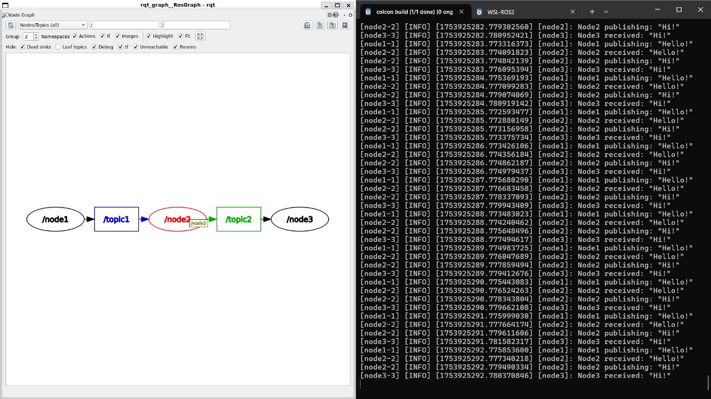

# MyEquation Internship – ROS 2 Module  
## 🧪 Task 2: Chained Publisher and Subscriber Nodes with Launch File

This is the second task under the **ROS 2 module** from my internship at **MyEquation**. It demonstrates a multi-stage message flow using **three nodes**, **two topics**, and a **launch file**.

---

## 🧠 Task Summary

This task involves chaining three ROS 2 nodes together through two topics:

1. `node1_publisher.py` publishes simple text messages to the topic `/topic1`.
2. `node2_middle.py` subscribes to `/topic1`, modifies the message, and publishes to `/topic2`.
3. `node3_subscriber.py` listens to `/topic2` and prints the final result.

A **launch file** is used to run all three nodes together automatically.

---

## 📂 Files Included

| File Name                 | Description                                       |
|---------------------------|---------------------------------------------------|
| `node1_publisher.py`      | First publisher node (publishes to `/topic1`)     |
| `node2_middle.py`         | Middle node (subscribes `/topic1`, publishes `/topic2`) |
| `node3_subscriber.py`     | Final subscriber node (subscribes to `/topic2`)   |
| `my_launch_file.launch.py`| Launch file to run all three nodes together       |
| `rqt_graph.jpg`           | Screenshot showing node-topic connections         |

---

## ▶️ How to Run

### 📦 Option 1: Run Manually

Make sure your ROS 2 workspace is built and sourced:

```bash
source install/setup.bash
```

Run each node in a separate terminal:

```bash
ros2 run part2_chained_pubsub node1_publisher
ros2 run part2_chained_pubsub node2_middle
ros2 run part2_chained_pubsub node3_subscriber
```

---

### 🚀 Option 2: Run Using Launch File

To launch all three nodes together:

```bash
ros2 launch part2_chained_pubsub my_launch_file.launch.py
```

Make sure the launch file is correctly registered and your workspace is built.

---

## 📸 Output Preview

Below is a screenshot of the ROS 2 RQT graph showing the communication between nodes and topics:



---

## 💡 Key Concepts Demonstrated

- Multi-node ROS 2 communication with `rclpy`
- Chained publisher-subscriber structure
- Use of multiple topics
- Writing and using launch files
- Visualizing node-topic flow using `rqt_graph`

---

## 📌 Internship Info

**Internship:** MyEquation  
**Duration:** 4 months  
**Module:** ROS 2 – Basic to Advanced  
**Task:** 2 – Chained Publisher-Subscriber with Launch File
