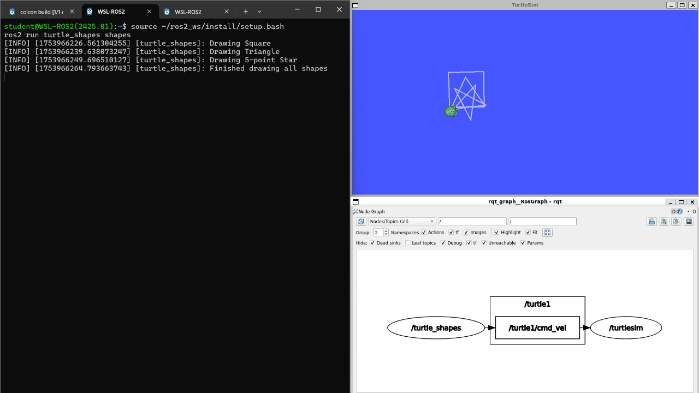

# MyEquation Internship – ROS 2 Module  
## 🧪 Task 3: Drawing Shapes with TurtleSim in ROS 2

This is the third task under the **ROS 2 module** from my internship at **MyEquation**. It demonstrates how to use the built-in `turtlesim` package to programmatically draw basic geometric shapes using ROS 2.

---

## 🧠 Task Objectives

Create a custom ROS 2 node that uses `geometry_msgs/Twist` to move the turtle and draw:

1. A Square 🟥  
2. A Triangle 🔺  
3. A 5-Pointed Star ⭐  

---

## 📂 Files Included

| File Name           | Description                                     |
|---------------------|-------------------------------------------------|
| `shape_drawer.py`   | Main node that draws square, triangle, and star |
| `Output_Image.jpg`  | Screenshot showing terminal, turtle drawing, and RQT graph |

---

## ▶️ How to Run the Node

Make sure `turtlesim` is installed:

```bash
sudo apt install ros-humble-turtlesim
```

Then source your workspace:

```bash
source ~/ros2_ws/install/setup.bash
```

Run the shape drawing node (adjust package name if needed):

```bash
ros2 run turtle_shapes shape_drawer
```

---

## 📸 Output Screenshot

The image below includes:
- Terminal output
- TurtleSim GUI with drawn shapes
- RQT Graph showing topic connections



---

## 💡 Key Concepts Demonstrated

- Publishing `geometry_msgs/Twist` messages to control movement
- Using angles and velocities to draw shapes
- Managing drawing sequences in ROS 2 with Python
- Integrating `turtlesim` and `rqt_graph` for debugging and visualizing

---

## 📌 Internship Info

**Internship:** MyEquation  
**Duration:** 4 months  
**Module:** ROS 2 – Basic to Advanced  
**Task:** 3 – TurtleSim Shape Drawing
